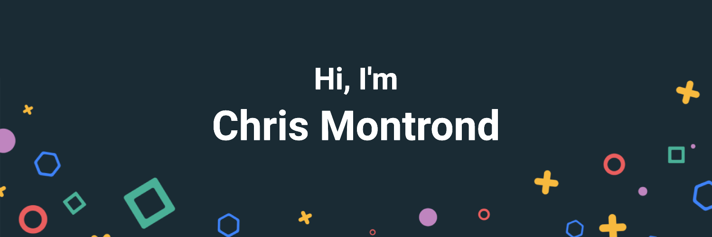

 

 

<!-- INTRODUCTION-SECTION:START -->

Hey there 👋

I’m Chris, an Engineer & Computer Scientist who specializes in full-stack web and mobile development. I am passionate about tackling different problems from ideation to pixel-perfect websites or applications that run blazing fast.

Want to know more about me? [Check out my LinkedIn.](https://www.linkedin.com/in/chris-montrond/)

<!-- INTRODUCTION-SECTION:END -->

<!-- ## 📝 Latest Blog Posts -->

<!-- BLOG-POST-LIST:START -->

<!-- Coming soon... -->

<!-- BLOG-POST-LIST:END -->

 

## 📌 Pinned Repositories

 

 

 
 

## &#x1f4c8; GitHub Stats

<!-- GitHub Stats -->

 

 
 

## 💼 Skills

 

More Skills

 

 

 

 

## 📣 How about a Game of Thrones quote before you go?

 

> Never forget what you are, for surely the world will not. Make it your strength. Then it can never be your weakness. Armor yourself in it, and it will never be used to hurt you.
>
> 
- Tyrion

 

_Quote requested from [The Game of Thrones Quotes API](https://github.com/wsizoo/game-of-thrones-quotes)_

Check back at the top of the hour for a new quote!

 